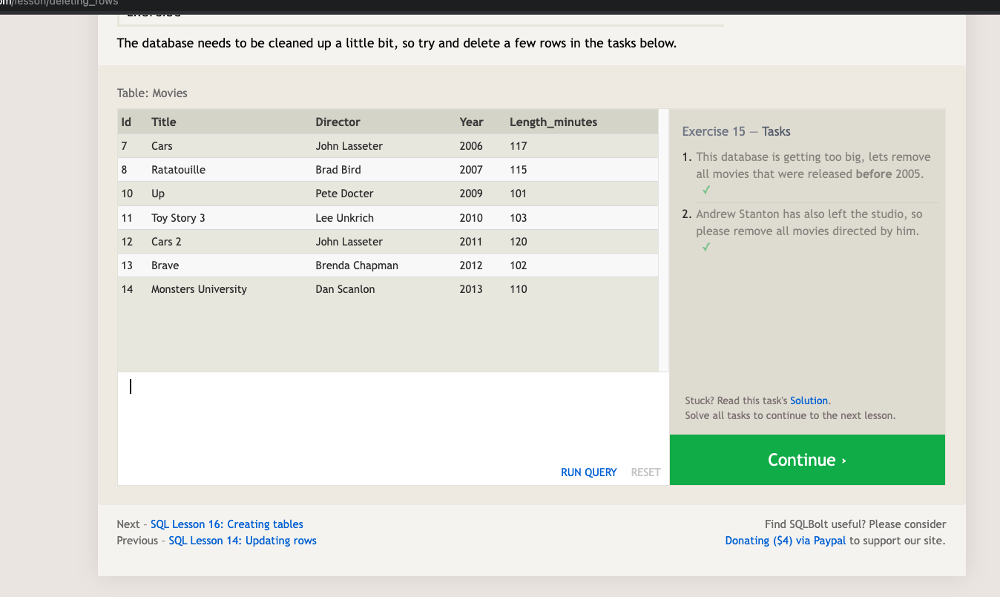

# SQL prework

### I do not have a lot of experience with microsoft excel but working with SQL seems somewhat similar but I would imagine it is far more powerful and easier to work with when extremely large datasets are being used.

